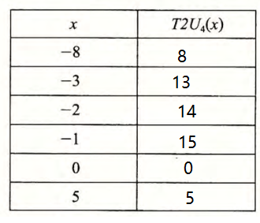

# 2.20

1:

$-8<0$ ，所以 $T2U_4(-8)=-8+2^4=8$

2:

$-3<0$ ，所以 $T2U_4(-3)=-3+2^4=13$

3:

$-2<0$ ，所以 $T2U_4(-2)=-2+2^4=14$

4:

$-1<0$ ，所以 $T2U_4(-1)=-1+2^4=15$

5:

$0\geqslant0$ ，所以 $T2U_4(0)=0$

6：

$5\geqslant 0$ ，所以 $T2U_4(5)=5$

