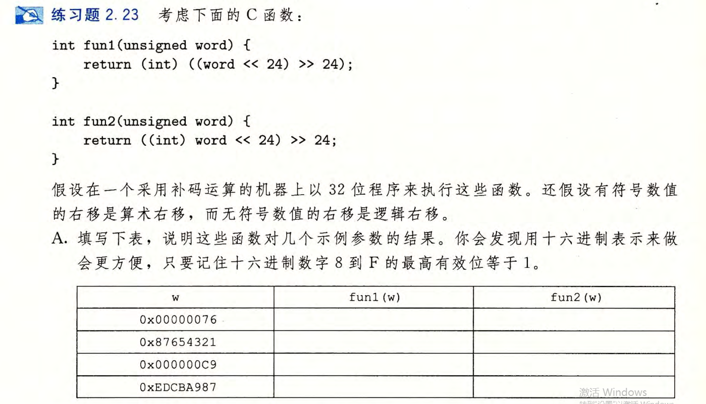
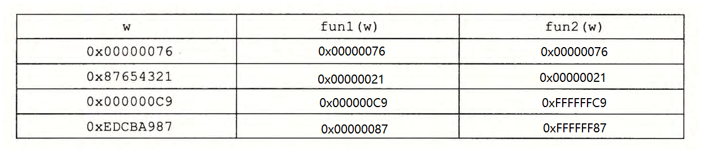
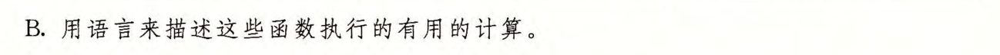

# 2.23

0x00000076:

fun1和fun2的运行结果一样，因为左移24位后最高位为0。

0x87654321:

fun1和fun2的运行结果一样，因为左移24位后最高位为0。

0x000000C9:

由于左移后最高位为1，fun1执行逻辑右移，fun2执行算数右移。

0xEDCBA987:

由于左移后最高位为1，fun1执行逻辑右移，fun2执行算数右移。

