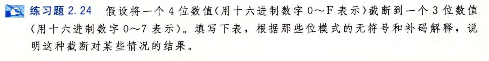
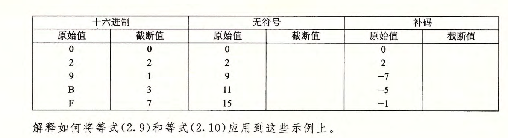

# 2.24

无符号:

$0=[0000]->[000]=0$

$2=[0010]->[010]=2$

$9=[1001]->[001]=1$

$11=[1011]->[011]=3$

$15=[1111]->[111]=7$

补码:

$0=[0000]->[000]=0$

$2=[0010]->[010]=2$

$-7=[1001]->[001]=1$

$-5=[1011]->[011]=3$

$-1=[1111]->[111]=-1$