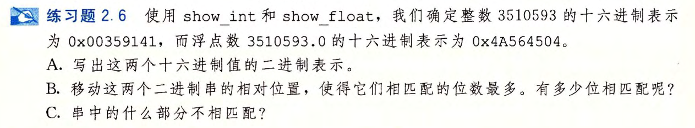

# 2.6

A.

`0x00359141=0000 0000 0011 0101 1001 0001 0100 0001`

`0x4A564504=0100 1010 0101 0110 0100 0101 0000 0100`

B.

00000000001101011001000101000001

​    01001010010101100100010100000100

C.

float的符号位和阶码部分不匹配，尾码部分除了最后两位以外其他部分都与int匹配 。