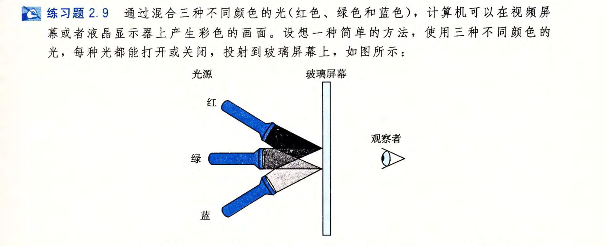
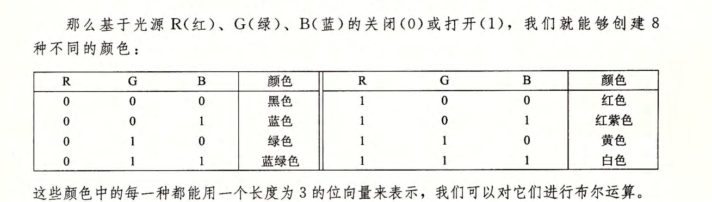
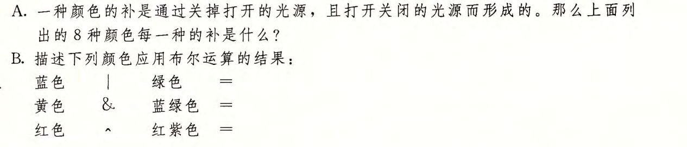

# 2.9

A:

`~黑色=~[000]=[111]=白色`

`~蓝色=~[001]=[110]=黄色`

`~绿色=~[010]=[101]=红紫色` 

`~蓝绿色=~[011]=[100]=红色`

`~红色=~[100]=[011]=蓝绿色`

`~红紫色=~[101]=[010]=绿色`

`~黄色=~[110]=[001]=蓝色`

`~白色=~[111]=[000]=黑色`

B:

`蓝色|绿色=[001]|[010]=[011]=蓝绿色`

`黄色&蓝绿色=[110]&[011]=[010]=绿色`

`红色^红紫色=[100]^[101]=[001]=蓝色`