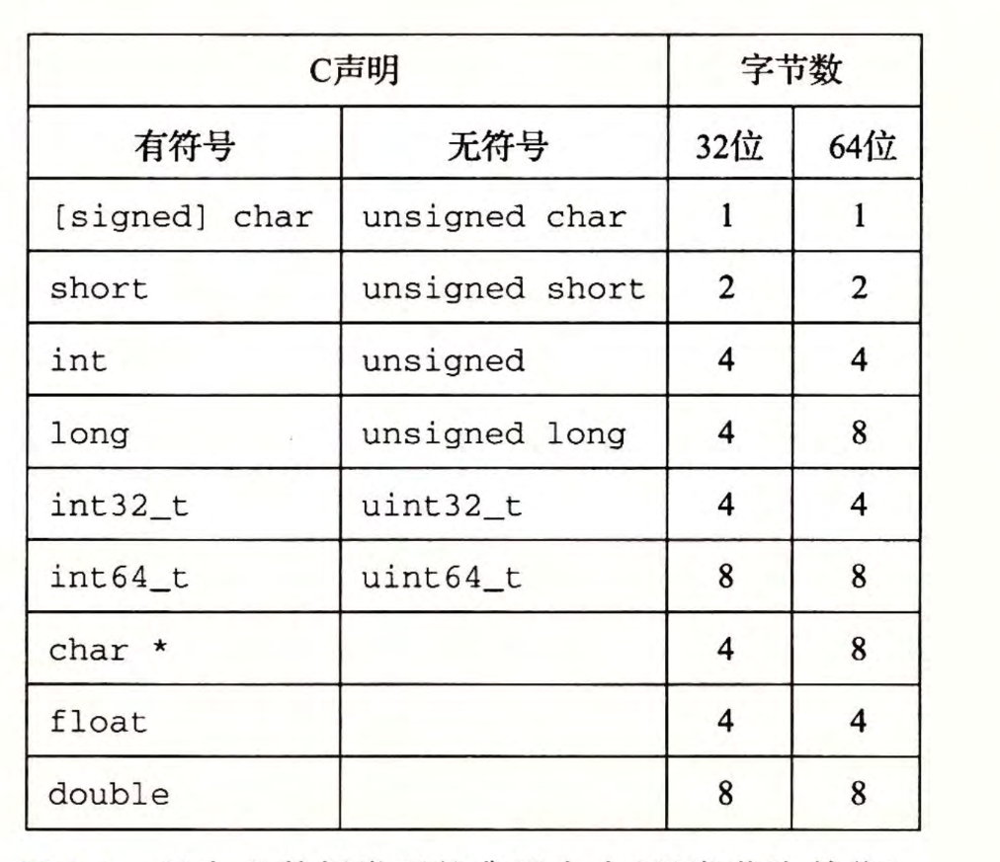
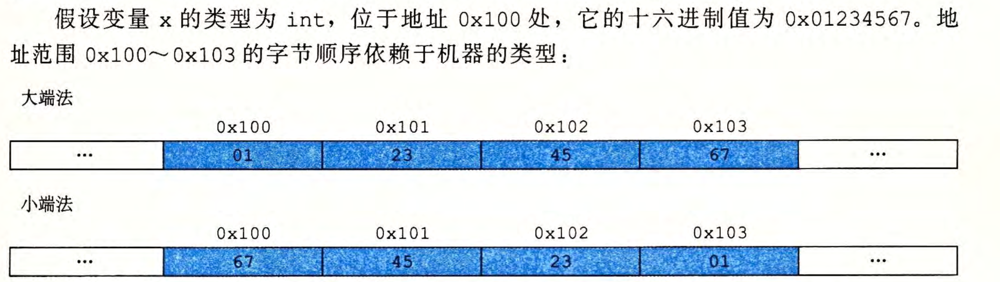
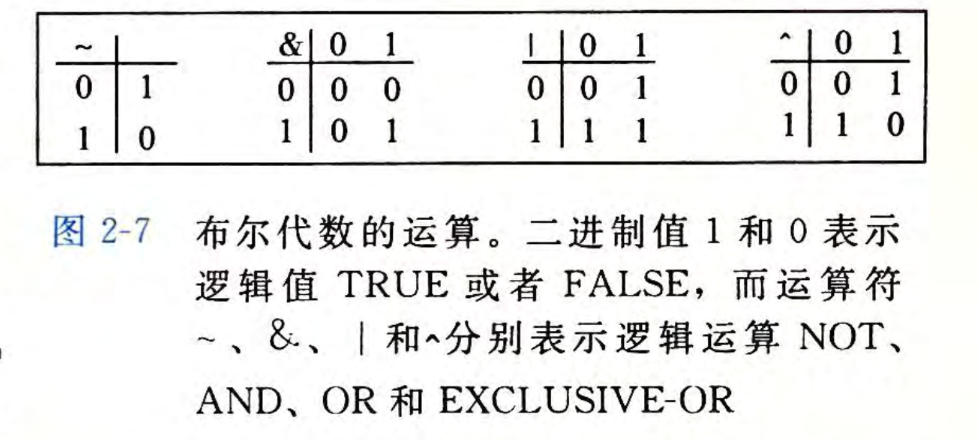
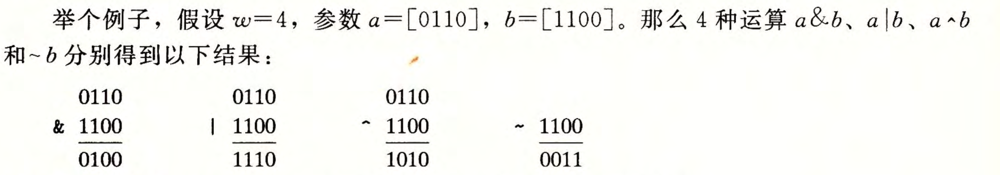
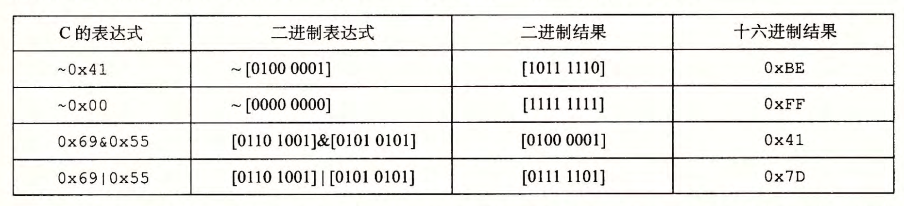
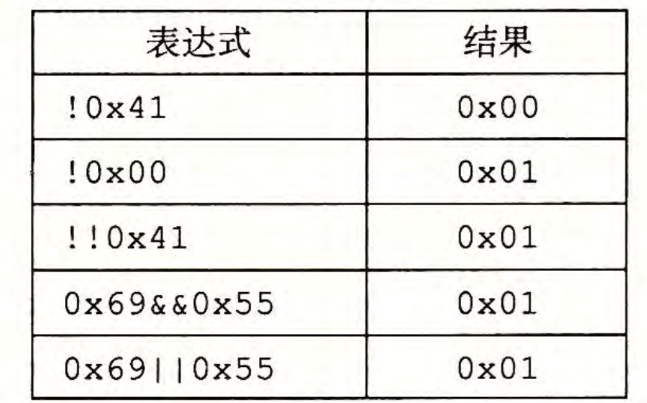
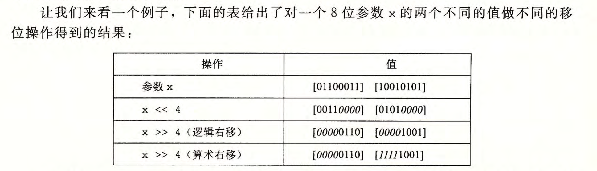

# 2.1 信息存储

- 大多数计算机使用8位的**块**，或者**字节**(byte),作为最小的可寻址的内存单位，而不是访问内存中单独的位。

- 机器级程序将内存视为一个**非常大的字节数组**，称为**虚拟内存**(virtual memory)。内存的每个字节都由一个唯一的数字来标识，称为它的**地址**(ad­dress), 所有可能地址的集合就称为**虚拟地址空间**(virtual address space)。

### 2.1.1 十六进制表示法

- 一个字节由8位组成。在二进制表示法中，它的值域是 $00000000_2\sim 11111111_2$ 。在十进制中，它的值域就是 $0_{10}\sim255_{10}$ 。

- 十六进制使用数字 $'0'~'9'$ 和字母 $'A'~'F'$ 表示16个可能的值。在十六进制中，一个字节的值域为 $00_{16}\sim FF_{16}$ 。

- 在C语言中，以0x或0X开头的数字常量被认为是十六进制的值。字符'A'~'F'既可以是大写，也可以是小写。

### 2.1.2 字数据大小

- 每台计算机都有一个**字长**(word size), 指明指针数据的标称大小(nominal size)。因为虚拟地址是以这样的一个字来编码的，所以字长决定的最重要的系统参数就是虚拟地址空间的最大大小。对于一个字长为 $w$ 位的机器而言，虚拟地址的范围为 $0\sim 2^w-1$ ,程序最多访问 $2^w$ 个字节。

- 基本C数据类型的典型大小(以字节为单位)。

- 大部分数据类型都编码为有符号数值，除非有前缀关键字unsigned或对确定大小的数据类型使用了特定的无符号声明。

### 2.1.3 寻址和字节顺序

- 排列表示一个对象的字节有两个通用的规则。考虑一个 $w$ 位的整数，其位表示为 $[x_{w-1},x_{w-2},...,x_1,x_0]$ ,其中 $x_{w-1}$ 是最高有效位，而 $x_0$ 是最低有效位。假设 $w$ 是8的倍数，这些位就能被分组成为字节，其中最高有效字节包含位 $[x_{w-1},x_{w-2},...,x_{w-8}]$ ,而最低有效字节包含位 $[x_7,x_6,...,x_0]$ 其他字节包含中间的位。某些机器选择在内存中按照从最低有效字节到最高有效字节的顺序存储对象，而另一些机器则按照从最高有效字节到最低有效字节的顺序存储。前一种规则——最低有效字节在最前面的方式，称为小端法(little endian)。后一种规则——最高有效字节在最前面的方式，称为大端法(big endian)。

- 字节顺序会产生的一些问题：

	- 在不同类型的机器之间通过网络传送二进制数据时，一个常见的问题是当小端法机器产生的数据被发送到大端法机器或者反过来时，接收程序会发现，字里的字节成了反序的。为了避免这类问题，网络应用程序的代码编写必须遵守已建立的关于字节顺序的规则，以确保发送方机器将它的内部表示转换成网络标准，而接收方机器则将网络标准转换为它的内部表示。
	- 当阅读表示整数数据的字节序列时字节顺序也很重要。这通常发生在检查机器级程序时。
	- 字节顺序变得重要的第三种情况是当编写规避正常的类型系统的程序时。在C语言中，可以通过使用**强制类型转换**(cast)或**联合**(union)来允许以一种数据类型引用一个对象，而这种数据类型与创建这个对象时定义的数据类型不同。大多数应用编程都强烈不推荐这种编码技巧，但是它们对系统级编程来说是非常有用，甚至是必需的。

	

### 2.1.4 表示字符串

- C语言中字符串被编码为一个以**null**(其值为0)字符结尾的字符数组。每个字符都由某个标准编码来表示，最常见的是**ASCII字符码**。

### 2.1.5 表示代码

- 不同的机器类型使用不同的且不兼容的指令和编码方式。即使是完全一样的进程，运行在不同的操作系统上也会有不同的编码规则，因此二进制代码是不兼容的。不同的机器类型使用不同的且不兼容的指令和编码方式。即使是完全一样的进程，运行在不同的操作系统上也会有不同的编码规则，因此二进制代码是不兼容的。

### 2.1.6 布尔代数简介

- 将逻辑值**TRUE**(真和**FALSE**(假编码为二进制值1和0,能够设计出一种代数，以研究逻辑推理的基本原则。

- 我们可以将上述4个布尔运算扩展到位向量的运算，位向量就是固定长度为 $w$ 、由0和1组成的串。位向量的运算可以定义成参数的每个对应元素之间的运算。假设 $a$ 和 $b$ 分别表示位向量 $[a_{w-1},a_{w-2},...,a_0]$ 和 $[b_{w-1},b_{w-2},...,b_0]$ 。我们将 $a$ & $b$ 也定义为一个长度为 $w$ 的位向量，其中第 $t$ 个元素等于$a$ & $b$, $0\leqslant i <w$ 。可以用类似的方式将运算  | , ^ 和～扩展到位向量上。

### 2.1.7 C语言中的位级运算

- C语言的一个很有用的特性就是它支持按位布尔运算。事实上，我们在布尔运算中使用的那些符号就是C语言所使用的：|就是OR(或），＆就是AND(与），～就是NOT(取反），而＾就是EXCLUSIVE-OR(异或）。这些运算能运用到任何“整型”的数据类型上，包括图2-3所示内容。以下是一些对char数据类型表达式求值的例子：

### 2.1.8 C语言中的逻辑运算

- C语言还提供了一组逻辑运算符||,&&和 ! ，分别对应千命题逻辑中的OR、AND和NOT运算。逻辑运算很容易和位级运算相混淆，但是它们的功能是完全不同的。逻辑运算认为所有非零的参数都表示TRUE,而参数0表示FALSE。它们返回1或者0,分别表示结果为TRUE或者为FALSE。以下是一些表达式求值的示例。

### 2.1.9 C语言中的移位运算

- C语言还提供了一组移位运算，向左或者向右移动位模式。对于一个位表示为 $[x_{w-1},x_{w-2},...,x_0]$ 的操作数 $x$ ,C表达式 $x<<k$ 会生成一个值，其位表示为 $[x_{w-k-1},x_{w-k-2},...,x_0,0,...,0]$ 。也就是说，$x$ 向左移动 $k$ 位，丢弃最高的 $k$ 位，并在右端补 $k$ 个 0 。移位量应该是一个$0 \sim w-1$之间的值。移位运算是从左至右可结合的，所以 $x<<j<<k$ 等价于 $(x<<j)<<k$ 。

- 有一个相应的右移运算 $x>>k$ ,但是它的行为有点微妙。一般而言，机器支持两种形式的右移：逻辑右移和算术右移。逻辑右移在左端补 $k$ 个0,得到的结果是$[0,...,0,x_{w-1},x_{w-2},...,x_k]$。算术右移是在左端补 $k$ 个最高有效位的值，得到的结果是 $[x_{w-1},...,x_{w-1},x_{w-1},x_{w-2},...,x_k]$ 。

