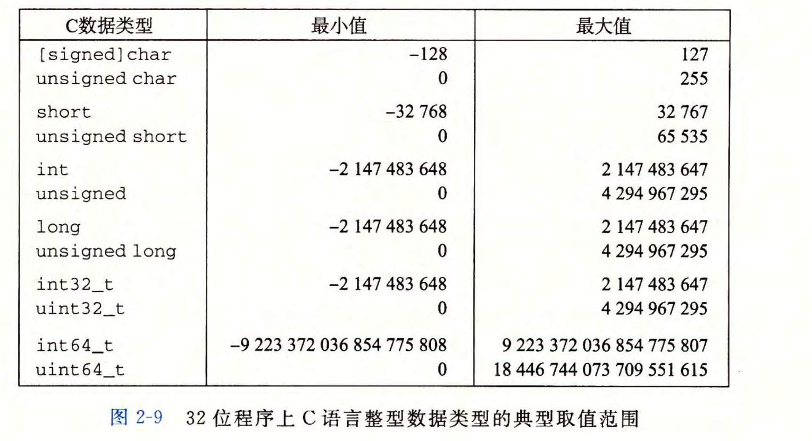
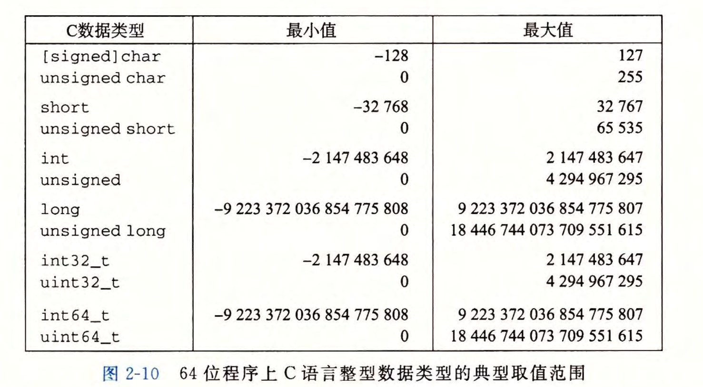

# 2.2 整数表示

- 在本节中，我们描述用位来编码整数的两种不同的方式：一种只能表示非负数，而另一种能够表示负数、零和正数。后面我们将会看到它们在数学属性和机器级实现方面密切相关。我们还会研究扩展或者收缩一个已编码整数以适应不同长度表示的效果。图2-8列出了我们引入的数学术语，用于精确定义和描述计算机如何编码和操作整数。这些术语将在描述的过程中介绍，图在此处列出作为参考。

### 2.2.1 整型数据类型

- C语言支持多种**整型**数据类型表示有限范围的整数。这些类型如图2-9和图2-10所示，其中还给出了"典型"32位和64位机器的取值范围。每种类型都能用关键字来指定大小，这些关键字包括char、short、long,同时还可以指示被表示的数字是非负数（声明为unsigned),或者可能是负数(默认)。

- C语言标准定义了每种数据类型必须能够表示的最小的取值范围。如图2-11所示，它们的取值范围与图2-9和图2-10所示的典型实现一样或者小一些。特别地，除了固定大小的数据类型是例外，我们看到它们只要求正数和负数的取值范围是对称的。

### 2.2.2 无符号数的编码

- 假设有一个整数数据类型有 $w$ 位。我们可以将位向量写成 $\vec{x}$ ,表示整个向量，或者写成$[x_{w-1},x_{w-2},...,x_0]$表示向量中的每一位。把 $\vec{x}$ 看做一个二进制表示的数，就获得了 $\vec{x}$ 的**无符号表示**。在这个编码中，每个位 $ x_i$ ,都取值为0或1,后一种取值意味着数值 $2^i$ 应为数字值的一部分。我们用一个函数 $B2U_w$ (Binary to Unsigned 的缩写，长度为 $w$ )来表示:

- 函数 $B2U_w$ 将一个长度为 $w$ 的0、1串映射到非负整数。例如:

- 让我们来考虑一下 $w$ 位所能表示的值的范围。最小值是用位向量 $[00...0]$ 表示，也就是整数值0,而最大值是用位向量$[11...1]$表示，也就是整数值$2^w-1$。

- 无符号数的二进制表示有一个很重要的属性，也就是每个介于 $0\sim 2^w-1$ 之间的数都有唯一一个 $w$ 位的值编码。

### 2.2.3 补码编码

- 对于许多应用，我们还希望表示负数值。最常见的有符号数的计算机表示方式就是**补码**(two's-complement)形式。在这个定义中，将字的最高有效位解释为负权(negative weight)。我们用函数 $B2T_w$ (Binaryto Two's-complement的缩写，长度为 $w$ )来表示：

- 最高有效位 $x_{w-1}$ 也称为符号位，它的"权重"为$-2^{w-1}$,是无符号表示中权重的负数。符号位被设置为1时，表示值为负，而当设置为0时，值为非负。例如:

	

- 让我们来考虑一下 $w$ 位补码所能表示的值的范围。它能表示的最小值是位向量 $[10...0]$(也就是设置这个位为负权，但是清除其他所有的位),其整数值为 $-2^{w-1}$ 。 而最大值是位向量 $[01...1]$ (清除具有负权的位，而设置其他所有的位)，其整数值为$2^{w-1}-1$。

- 同无符号表示一样，在可表示的取值范围内的每个数字都有一个唯一的 $w$ 位的补码编码。同无符号表示一样，在可表示的取值范围内的每个数字都有一个唯一的 $w$ 位的补码编码。

- 图2-14展示了针对不同字长，几个重要数字的位模式和数值。前三个给出的是可表示的整数的范围，用$UMax_w$、$TMin_w$和$TMax_w$来表示。在后面的讨论中，我们还会经常引用到这三个特殊的值。如果可以从上下文中推断出 $w$ ,或者 $w$ 不是讨论的主要内容时，我们会省略下标 $w$ ,直接引用 $UMax$、$TMin$ 和 $TMax$。

- 补码的范围是不对称的: $|TMin|=|TMax|+1$, 也就是说，$TMin$ 没有与之对应的正数。之所以会有这样的不对称性，是因为一半的位模式（符号位设置为1的数）表示负数，而另一半（符号位设置为0的数）表示非负数。因为0是非负数，也就意味着能表示的正数比负数少一个。

- 最大的无符号数值刚好比补码的最大值的两倍大一点: $UMax=2TMax+1$ 。补码表示中所有表示负数的位模式在无符号表示中都变成了正数。

- 注意-1和 $UMax$ 有同样的位表示——全1的串。数值0在两种表示方式中都是全0的串。

- 有符号数的其它两种表示方法:

### 2.2.4 有符号数和无符号数之间的转换

- C语言允许在各种不同的数字数据类型之间做**强制类型转换**。强制类型转换的结果保持位值不变，只是改变了解释这些位的方式。

- 给定位模式的补码与无符号数之间的关系可以表示为函数 $T2U$ 的一个属性：

- 一个无符号数 $u$ 和与之对应的有符号数 $U2T$ 之间的关系：

### 2.2.5 C语言中的有符号数和无符号数

- C语言支持所有整型数据类型的有符号和无符号运算。例如，当声明一个像12345或者0x1A2B这样的常量时，这个值就被认为是有符号的。要创建一个无符号常量，必须加上后缀字符'u'或者'U',例如，12345U或者0x1A2Bu。

- 当一种类型的表达式被赋值给另外一种类型的变量时，转换是隐式发生的:

- 当用printf输出数值时，分别用指示符%d、%u和%x以有符号十进制、无符号十进制和十六进制格式输出一个数字。注意printf没有使用任何类型信息，所以它可以用指示符%u来输出类型为int的数值，也可以用指示符%d输出类型为unsigned的数值。例如，考虑下面的代码：

- 由于C语言对同时包含有符号和无符号数表达式的这种处理方式，出现了一些奇特的行为。当执行一个运算时，如果它的一个运算数是有符号的而另一个是无符号的，那么C语言会隐式地将有符号参数强制类型转换为无符号数，并假设这两个数都是非负的，来执行这个运算。就像我们将要看到的，这种方法对于标准的算术运算来说并无多大差异，但是对于像＜和＞这样的关系运算符来说，它会导致非直观的结果。

### 2.2.6 扩展一个数字的位表示

- 一个常见的运算是在不同字长的整数之间转换，同时又保持数值不变。当然，当目标数据类型太小以至于不能表示想要的值时，这根本就是不可能的。然而，从一个较小的数据类型转换到一个较大的类型，应该总是可能的。

- 要将一个无符号数转换为一个更大的数据类型，我们只要简单地在表示的开头添加0。这种运算被称为**零扩展**(zero extension) , 表示原理如下：

- 要将一个补码数字转换为一个更大的数据类型，可以执行一个**符号扩展**(signexten-sion), 在表示中添加最高有效位的值，表示为如下原理：

- 值得一提的是，从一个数据大小到另一个数据大小的转换，以及无符号和有符号数字之间的转换的相对顺序能够影响一个程序的行为。考虑下面的代码：

- 有两种顺序:

	- 先把short变成unsigned short，再把unsigned short变为unsigned int:
	- short -> unsigned short： cf c7 -> cf c7
	- unsigned short -> unsigned int： cf c7 -> 00 00 cf c7

	- 先把short变成int，再把int变成unsigned int:
	- short -> int：cf c7 -> ff ff cf c7
	- int -> unsigned int：ff ff cf c7 -> ff ff cf c7

- 实际结果为第二种顺序显示的结果。这表明当把short转换成unsigned时，我们先要改变大小，之后再完成从有符号到无符号的转换。也就是说(unsigned) sx等价于(unsigned) (int) sx, 求值得到4294954951, 而不等价于(unsigned)(unsigned short) sx, 后者求值得到53191。事实上，这个规则是C语言标准要求的。

### 2.2.7 截断数字

- 当将一个 $w$ 位的数 $\vec{x}=[x_{w-1},x_{w-2},...,x_0]$ 截断为一个 $k$ 位数字时，我们会丢弃高 $w-k$ 位，得到一个位向量 $\vec{x}'=[x_{k-1},x_{k-2},...,x_0]$ 。截断一个数字可能会改变它的值溢出的一种形式。对于一个无符号数，我们可以很容易得出其数值结果。

- 补码截断也具有相似的属性，只不过要将最高位转换为符号位：

### 2.2.8 关于有符号数与无符号数的建议

- 有符号数到无符号数的隐式强制类型转换导致了某些非直观的行为。而这些非直观的特性经常导致程序错误，并且这种包含隐式强制类型转换的细微差别的错误很难被发现。因为这种强制类型转换是在代码中没有明确指示的情况下发生的，程序员经常忽视了它的影响。下面两个练习题说明了某些由于隐式强制类型转换和无符号数据类型造成的细微的错误：

- 形参length的类型是无符号整型，在第6行中，如果length=0, length-1的值会变成非常大的正整数，导致数组越界。

- strlen函数返回的类型是size_t，其被定义为unsigned int ，那么如果strlen(s)<strlen(t)，strlen(s)-strlen(t)的数值是负数，但是在无符号表示下可能是一个非常大的正整数。因此需要把返回语句改为 strlen(s)>strlen(t)。

- 虽然可能会带来一些错误，但是无符号数值是非常有用的。例如，往一个字中放入描述各种布尔条件的标记(flag)时，就是这样。地址自然地就是无符号的，所以系统程序员发现无符号类型是很有帮助的。当实现模运算和多精度运算的数学包时，数字是由字的数组来表示的，无符号值也会非常有用。