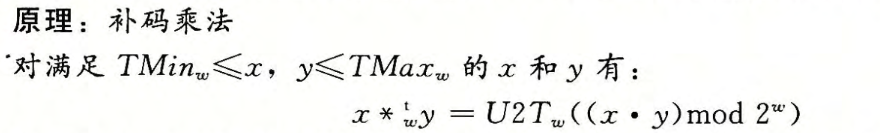

# 2.3 整数运算

### 2.3.1 无符号加法

- 让我们为参数 $x$ 和 $y$ 定义运算 $+_w^u$ ，其中 $0\leqslant x,y<2^w$ ，该操作是把整数和 $x+y$ 截断为 $w$ 位得到的结果，再把这个结果看做是一个无符号数。这可以被视为一种形式的模运算，对 $x+y$ 的位级表示，简单丢弃任何权重大于 $2^{w-1}$ 的位就可以计算出和模 $2^w$ 。

- 说一个算术运算**溢出**，是指完整的整数结果不能放到数据类型的字长限制中去。

- 当执行C程序时，不会将溢出作为错误而发信号。不过有的时候，我们可能希望判定是否发生了溢出。

- 模数加法形成了一种数学结构，称为**阿贝尔群**(Abelian group)。也就说，它是可交换的（这就是为什么叫"abelian"的地方）和可结合的。它有一个单位元0,并且每个元素有一个加法逆元。让我们考虑 $w$ 位的无符号数的集合，执行加法运算 $+^u_w$ 。对于每个值 $x$ ，必然有某个值 $-^u_wx$ 满足 $-^u_wx+^u_wx=0$ 。该加法的逆操作可以表述如下：

### 2.3.2 补码加法

- 定义 $x+^t_wy$ 为整数和 $x+y$ 被截断为 $w$ 位的结果，并将这个结果看做是补码数。

- 会发生溢出的情况：

### 2.3.3 补码的非

- 可以看到范围在 $TMin_w\leqslant x \leqslant TMax_w$ 中的每个数字 $x$ 都有 $+^t_w$ 下的加法逆元，我们将 $-^t_wx$ 表示如下。

### 2.3.4 无符号乘法

- 范围在 $0\leqslant x,y\leqslant 2^w-1$ 内的整数 $x$ 和 $y$ 可以被表示为 $w$ 位的无符号数，但是它们的乘积 $x•y$ 的取值范围为 0 到 $(2^w-1)^2=2^{2w}-2^{w+1}+1$ 之间。这可能需要 $2w$ 位来表示。不过，C语言中的无符号乘法被定义为产生 $w$ 位的值，就是 $2w$ 位的整数乘积的低 $w$ 位表示的值。我们将这个值表示为 $x*^u_wy$ 。将一个无符号数截断为 $w$ 位等价于计算该值模 $2^w$ ，得到：

### 2.3.5 补码乘法

- 范围在 $-2^{w-1}$ 内的整数 $x$ 和 $y$ 可以被表示为 $w$ 位的补码数字，但是它们的乘积 $x•y$ 的取值范围为 $-2^{w-1}\times (2^{w-1}-1)=-2^{2w-2}+2^{w-1}$ 到 $-2^{w-1}\times -2^{w-1}$ 之间。要想用补码来表示这个乘积，可能需要 $2w$ 位。然而，C语言中的有符号乘法是通过将 $2w$ 位的乘积截断为 $w$ 位来实现的。我们将这个数值表示为 $x*^t_wy$ 。将一个补码数截断为 $w$ 位相当千先计算该值模 $2^w$ ,再把无符号数转换为补码，得到：

### 2.3.6 乘以常数

- 编译器试着用**移位**和**加法运算**的组合来代替乘以常数因子的乘法。首先，我们会考虑乘以2的幂的情况，然后再概括成乘以任意常数。

- 当对固定字长左移 $k$ 位时，其高 $k$ 位被丢弃，得到 $[x_{w-k-1},x_{w-k-2},...,0,...,0]$ 。

- 由于固定大小的补码算术运算的位级操作与其无符号运算等价，我们就可以对补码运算的2的幂的乘法与左移之间的关系进行类似的表述：

- 无论是无符号运算还是补码运算，乘以2的幕都可能会导致溢出。结果表明，即使溢出的时候，我们通过移位得到的结果也是一样的。

- 选择使用移位、加法和减法的组合，还是使用一条乘法指令，取决于这些指令的相对速度，而这些是与机器高度相关的。大多数编译器只在需要少量移位、加法和减法就足够的时候才使用这种优化。

### 2.3.7 除以2的幂

- 除以2的幂也可以用移位运算来实现，只不过我们用的是右移，而不是左移。无符号和补码数分别使用逻辑移位和算术移位来达到目的。

- 对位向量 $[x_{w-1},x_{w-2},...,x_0]$ 逻辑右移 $k$ 位会得到位向量 $[0,...,0,x_{w-1},...,x_k]$ 。

- 对于除以2的幂的补码运算来说，情况要稍微复杂一些。首先，为了保证负数仍然为负，移位要执行的是算术右移。

- 对于 $x\geqslant 0$ ,变量 $x$ 的最高有效位,所以效果与逻辑右移是一样的。因此，对于非负数来说，算术右移k位与除以 $2^k$ 是一样的。对于$x<0$ ，算术右移位向量 $[x_{w-1},x_{w-2},...,x_0]$ k位，得到位向量 $[x_{w-1},...,x_{w-1},x_{w-1},x_{w-2},...,x_k]$ 。它刚好就是将 $[x_{w-1},x_{w-2},...,x_k]$ 从 $w-k$ 位符号扩展到 $w$ 位。因此，这个位移后的位向量就是 $\lfloor x/2^k \rfloor$ 的补码表示。

- 如果想得到 $\lceil x/2^k\rceil$，则可以通过 $\lfloor (x+2^k-1)/2^k \rfloor$ 求得，在C中的表达式即为 `(x+(1<<k)-1)>>k `

### 2.3.8 关于整数运算的最后思考

- 正如我们看到的，计算机执行的“整数”运算实际上是一种模运算形式。表示数字的有限字长限制了可能的值的取值范围，结果运算可能溢出。我们还看到，补码表示提供了一种既能表示负数也能表示正数的灵活方法，同时使用了与执行无符号算术相同的位级实现，这些运算包括像加法、减法、乘法，甚至除法，无论运算数是以无符号形式还是以补码形式表示的，都有完全一样或者非常类似的位级行为。
