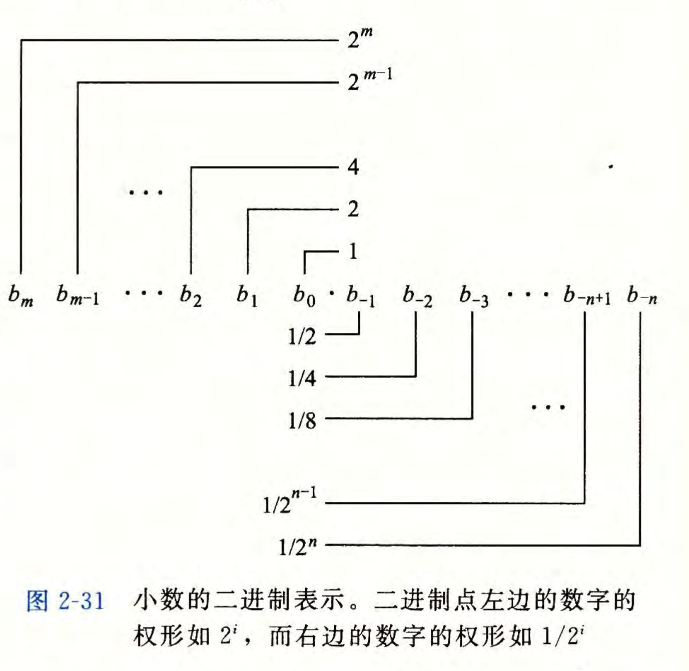
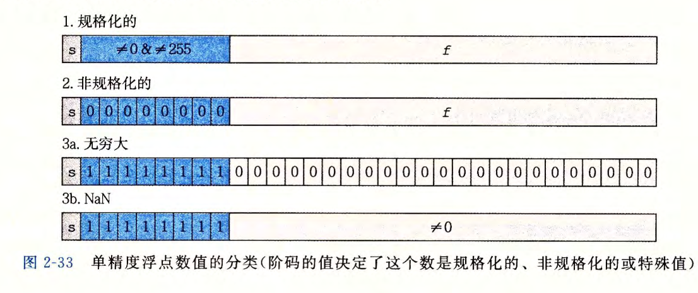
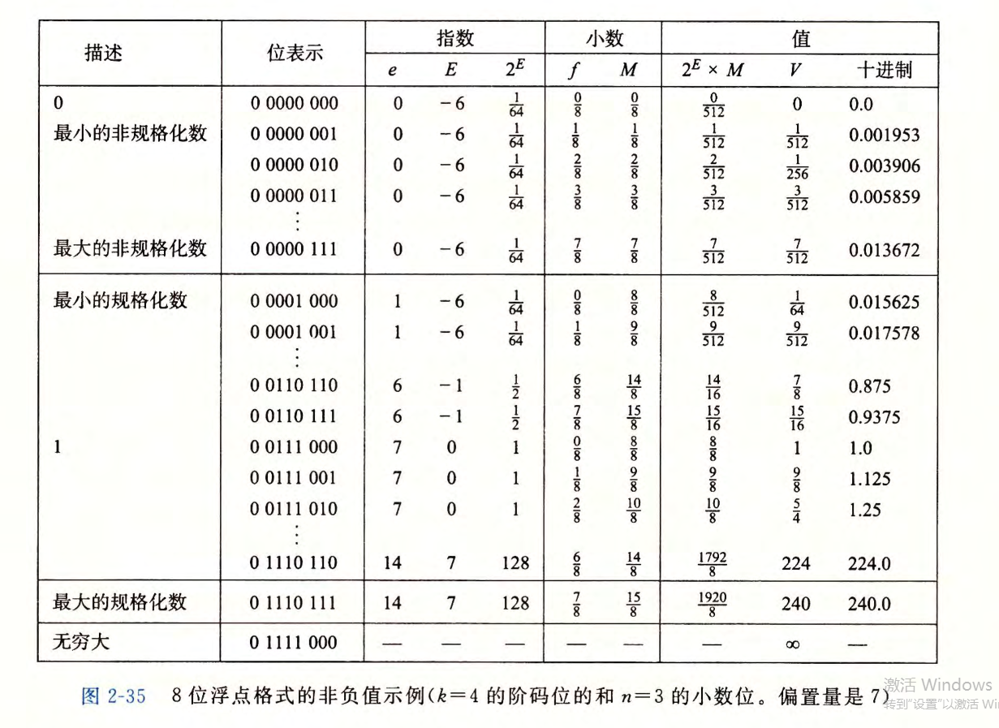
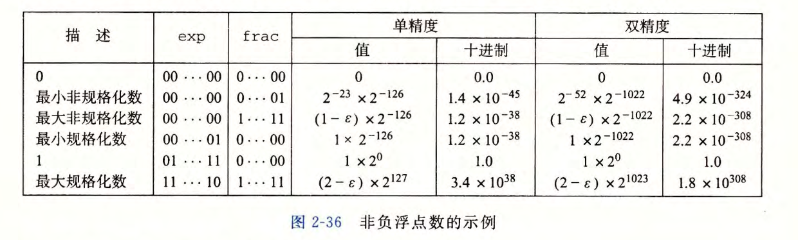
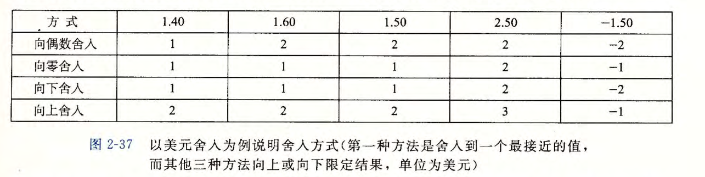
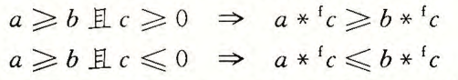

# 2.4 浮点数

- 本节讨论IEEE浮点格式中数字的表示方法，舍入问题，加法、乘法和关系运算符的数学属性。

### 2.4.1 二进制小数

- 十进制表示法使用如下形式的表示：

$$
d_md_{m-1}...d_1d_0.d_{-1}d_{-2}...d_{{-n}}
$$

- 其中每个十进制数 $d_i$ 的取值范围是0~9。这个表达描述的数值 $d$ 定义如下：

$$
d=\sum\limits^{m}_{i=-n} 10^i \times d_i
$$

- 小数点左边的数字的权是10的正幂，得到整数值，而小数点右边的数字的权是10的负幂，得到小数值。

- 类似，考虑一个形如：

$$
b_mb_{m-1}...b_1b_0.b_{-1}b_{-2}...b_{-n-1}b_{-n}
$$

- 其中每个二进制数字，或者称为位， $i$ 的取值范围是0和1。

$$
b=\sum\limits^{m}_{i=-n}2^i\times b_i
$$

- 二进制小数点向左移动一位相当于这个数被2除。同理，向右移动一位相当于这个数乘2。

- 注意，形如 $0.111...1_2$ 的数表示的是刚好小于1的数。例如，$0.111111_2$表示$\frac{63}{64}$ ，我们将用简单的表达法 $1.0 -\varepsilon $ 来表示这样的数值。

### 2.4.2 IEEE浮点表示

- IEEE浮点标准用 $V=(-1)^s\times M\times 2^E$ 的形式来表示一个数：
  - **符号**(sign) $s$ 决定这数是负数( $s=1$ )还是正数( $s=0$ ),而对于数值0的符号位解释作为特殊情况处理。
  - **尾数**(significand) $M$ 是一个二进制小数，它的范围是 $1\sim 2-\varepsilon$，或者是 $0\sim 1-\varepsilon$。
  - **阶码**(exponent) $E$ 的作用是对浮点数加权，这个权重是2的 $E$ 次幂（可能是负数）。

- 将浮点数的位表示划分为三个字段，分别对这些值进行编码：
  - 一个单独的符号位 $s$ 直接编码符号 $s$。
  - $k$ 位的阶码字段 $exp=e_{k-1}...e_1,e_0 $编码阶码 $E$ 。
  - $n$ 位小数字段 $frac=f_{n-1}...f_1f_0$ 编码尾数 $M$ , 但是编码出来的值也依赖于阶码字段的值是否等于0。

- 在单精度浮点格式(C语言中的float)中，$s$ 、$exp$ 和 $frac$ 字段分别为1位、$k=8$ 位和 $n=23$ 位，得到一个32位的表示。在双精度浮点格式(C语言中的double)中，$s$、$exp$ 和 $frac$ 字段分别为1位、$k=11$位和 $n=52$ 位，得到一个64位的表示。

- 给定位表示，根据 $exp$ 的值，被编码的值可以分成三种不同的情况（最后一种情况有两个变种）。图2-33说明了对单精度格式的情况。

- **情况1: 规格化的值**

  ​		这是最普遍的情况。当 $exp$ 的位模式既不全为0(数值0),也不全为1(单精度数值为255, 双精度数值为2047)时，都属于这类情况。在这种情况中，阶码字段被解释为以**偏置**(biased)形式表示的有符号整数。也就是说，阶码的值是 $E=e-Bias$, 其中 $e$ 是无符号数，其位表示为$e_{k-1}...e_1,e_0$，而 $Bias$ 是一个等于 $2^{k-1}-1$ (单精度是127,双精度是1023)的偏置值。由此产生指数的取值范围，对于单精度是 $-126\sim+127$ , 而对于双精度是 $-1022\sim+1023$ 。

  ​		小数字段 $frac$ 被解释为描述小数值 $f$ ,其中 $0\leqslant f<1$ ,其二进制表示为 $0.f_{n-1}...f_1f_0$ ，也就是二进制小数点在最高有效位的左边。尾数定义为 $M=1+f$ 。有时，这种方式也叫做**隐含的以1开头的**(implied leading 1)表示，因为我们可以把 $M$ 看成一个二进制表达式为 $1.f_{n-1}...f_1f_0$ 的数字。既然我们总是能够调整阶码 $E$ ,使得尾数 $M$ 在范围 $1\leqslant M<2$ 之中（假设没有溢出），那么这种表示方法是一种轻松获得一个额外精度位的技巧。既然第一位总是等于1,那么我们就不需要显式地表示它。

- **情况2: 非规格化的值**

  ​		当阶码域为全0时，所表示的数是**非规格化**形式。在这种情况下，阶码值是 $E=1-Bias$ , 而尾数的值是 $M=f$ ,也就是小数字段的值，不包含隐含的开头的1。

  ​        非规格化数有两个用途。首先，它们提供了一种表示数值0的方法，因为使用规格化数，我们必须总是使 $M\geqslant 1$ ,因此我们就不能表示0。实际上，$+0.0$的浮点表示的位模式为全0:符号位是0,阶码字段全为0(表明是一个非规格化值），而小数域也全为0,这就得到 $M=f=0$。令人奇怪的是，当符号位为1,而其他域全为0时，我们得到值 $-0.0$ 。根据IEEE的浮点格式，值 $+0.0$ 和 $-0.0$ 在某些方面被认为是不同的，而在其他方面是相同的。

  ​        非规格化数的另外一个功能是表示那些非常接近于0.0的数。它们提供了一种属性，称为**逐渐溢出**(gradual underflow) , 其中，可能的数值分布均匀地接近于0.0。

- **情况3: 特殊值**

  ​        最后一类数值是当指阶码全为1的时候出现的。当小数域全为0时，得到的值表示无穷，当 $s=0$ 时是 $+\infty$ ,或者当 $s=1$ 时是 $-\infty$ 。当我们把两个非常大的数相乘，或者除以零时，无穷能够表示溢出的结果。当小数域为非零时，结果值被称为"NaN",即“不是一个数(Nota Number)"的缩写。一些运算的结果不能是实数或无穷，就会返回这样的NaN值，比如当计算 $\sqrt{-1}$ 或 $\infty-\infty$ 时。在某些应用中，表示未初始化的数据时，它们也很有用处。

### 2.4.3 数字示例

- 图2-35展示了假定的8位浮点格式的示例，其中有 $k=4$ 的阶码位和 $n=3$ 的小数位。偏置量是 $2^{4-1}-1=7$ 。图被分成了三个区域，来描述三类数字。不同的列给出了阶码字段是如何编码阶码 $E$ 的，小数字段是如何编码尾数 $M$ 的，以及它们一起是如何形成要表示的值 $V=2^E\times M$ 的。从0自身开始，最靠近0的是非规格化数。这种格式的非规格化数的 $E=1-7=-6$ , 得到权 $2^E=\frac{1}{64}$ 。小数 $f$ 的值的范围是 $0,\frac{1}{8},...,\frac{7}{8}$ 从而得到数 $V$ 的范围是 $0\sim \frac{1}{64}\times \frac{7}{8}=\frac{7}{512}$ 。

- 可以观察到最大非规格化数 $\frac{7}{512}$ 和最小规格化数 $\frac{8}{512}$ 之间的平滑转变。这种平滑性归功于我们对非规格化数的 $E$ 的定义。通过将 $E$ 定义为 $1-Bias$ ,而不是 $-Bias$ ,我们可以补偿非规格化数的尾数没有隐含的开头的1。

- 这种表示具有一个有趣的属性，假如我们将图2-35中的值的位表达式解释为无符号整数，它们就是按升序排列的，就像它们表示的浮点数一样。这不是偶然的IEEE格式如此设计就是为了浮点数能够使用整数排序函数来进行排序。

- 图2-36展示了一些重要的单精度和双精度浮点数的表示和数字值。根据图2-35中展示的8位格式，我们能够看出有 $k$ 位阶码和 $n$ 位小数的浮点表示的一般属性。

- 值 $+0.0$ 总有一个全为0的位表示。
- 最小的正非规格化值的位表示，是由最低有效位为1而其他所有位为0构成的。它具有小数（和尾数）值 $M=f=2^{-n}$ 和阶码值 $E=-2^{k-1}+2$ 。因此它的数字值是 $V=(1-2^{-n})\times 2^{-2^{k-1}+2}$ 。 

- 最大的非规格化值的位模式是由全为0的阶码字段和全为1的小数字段组成的。它有小数（和尾数）值 $M=f=1-2^{-n}$ (我们写成 $1-\varepsilon$ )和阶码值 $E=-2^{k-1}+2$ 。因此，数值 $V=(1-2^{-n})\times2^{-2^{k-1}+2}$ 这仅比最小的规格化值小一点。
- 最小的正规格化值的位模式的阶码字段的最低有效位为1,其他位全为0。它的尾数值 $M=1$ ,而阶码值 $E=-2^{k-1}+2$ 。因此，数值 $V=2^{-2^{k-1}+2}$ 。
- 值1.0的位表示的阶码字段除了最高有效位等于1以外，其他位都等于0。它的尾数值是 $M=1$ ,而它的阶码值是 $E=0$ 。
- 最大的规格化值的位表示的符号位为0,阶码的最低有效位等于0,其他位等于1。它的小数值 $f=1-2^{-n}$ ,尾数 $M=2-2^{-n}$ (我们写作 $2-\varepsilon$ )。它的阶码值$E=2^{k-1}-1$，得到数值 $V=(2-2^{-n})\times2^{2^{k-1}-1}=(1-2^{-n-1})\times 2^{2^{k-1}}$ 。

### 2.4.4 舍入

- 图2-37举例说明了四种舍入方式，将一个金额数舍入到最接近的整数美元数。**向偶数舍入**(round-to-even), 也被称为**向最接近的值舍入**(round-to-nearest), 是默认的方式，试图找到一个最接近的匹配值。因此，它将1.40美元舍入成1美元，而将1.60美元舍入成2美元，因为它们是最接近的整数美元值。唯一的设计决策是确定两个可能结果中间数值的舍入效果。向偶数舍入方式采用的方法是：它将数字向上或者向下舍入，使得结果的最低有效数字是偶数。因此，这种方法将1.5美元和2.5美元都舍入成2美元。

- 向偶数舍入可以减小统计平均值时的偏差,50%的数据向上舍入，50%的数据向下舍入。

- 相似地，向偶数舍入法能够运用在二进制小数上。我们将最低有效位的值0认为是偶数，值1认为是奇数。一般来说，只有对形如 $XX...X_.YY100...$ 的二进制位模式的数，这种舍入方式才有效，其中 $X$ 和 $Y$ 表示任意位值，最右边的Y是要被舍入的位置。只有这种位模式表示在两个可能的结果正中间的值。

### 2.4.5 浮点运算

- 把浮点值 $x$ 和 $y$ 看成实数，而某个运算 $\odot$ 定义在实数上，计算将产生 $Round(x\odot y)$ ,这是对实际运算的精确结果进行舍入后的结果。当参数中有一个是特殊值（如 $-0、-\infty$ 或 $NaN$ ）时，IEEE标准定义了一些使之更合理的规则。例如，定义 $1/-0$ 将产生 $-\infty$ ,而定义 $1/+0$ 会产生 $+\infty$ 。

- 前面我们看到了整数（包括无符号和补码）加法形成了阿贝尔群。实数上的加法也形成了阿贝尔群，但是我们必须考虑舍入对这些属性的影响。我们将 $x+^fy$ 定义为 $Round(x+y)$ 。这个运算的定义针对 $x$ 和 $y$ 的所有取值，但是虽然 $x$ 和 $y$ 都是实数，由于溢出，该运算可能得到无穷值。对于所有 $x$ 和 $y$ 的值，这个运算是可交换的，也就是说 $x+^fy=y+^fx$。另一方面，这个运算是不可结合的。例如，使用单精度浮点，表达式 $(3.14+1e10)-1e10$ 求值得到 $0.0$ ——因为舍入，值 $3.14$ 会丢失。另一方面，表达式 $3.14+(1e10-1e10)$ 得出值 $3. 14$ 。作为阿贝尔群，大多数值在浮点加法下都有逆元，也就是说 $x+^f-x=0$ 。无穷（因为 $+\infty - \infty =NaN$ ）和 $NaN$ 是例外情况，因为对于任何 $x$ ,都有 $NaN+^fx=NaN$。

- 浮点加法满足了单调性属性：如果 $a\geqslant b$，那么对于任何 $a、b$ 以及 $x$ 的值，除了 $NaN$ ，都有 $x+a\geqslant x+b$ 。无符号或补码加法不具有这个实数（和整数）加法的属性。

- 浮点乘法也遵循通常乘法所具有的许多属性。我们定义 $x*^fy$ 为 $Round(x\times y)$ 。这个运算在乘法中是封闭的（虽然可能产生无穷大或 $NaN$ ）,它是可交换的，而且它的乘法单位元为 $1.0$ 。另一方面，由于可能发生溢出，或者由于舍入而失去精度，它不具有可结合性。例如，单精度浮点情况下，表达式 $(1e20*1e20)*1e-20$ 求值为 $+\infty$ ,而 $1e20*(1e20*1e-20)$ 将得出 $1e20$ 。另外，浮点乘法在加法上不具备分配性。例如，单精度浮点情况下，表达式 $1e20*(1e20-1e20)$ 求值为 $0.0$ ，而 $1e20*1e20 -1e20*1e20$ 会得出 $NaN$ 。

-  对 于任何 $a、b$ 和 $c$ ,并且 $a、b $ 和 $c$ 都不等于 $NaN$ ,浮点乘法满足下列单调性：

- 此外，我们还可以保证，只要 $a\neq NaN$ ,就有 $a*^fa\geqslant0$ 。像我们先前所看到的，无符号或补码的乘法没有这些单调性属性。

### 2.4.6 C语言中的浮点数

- 所有的C语言版本提供了两种不同的浮点数据类型：float和double。当在int、float和double格式之间进行强制类型转换时，程序改变数值和位模式的原则如下（假设int是32位的）：
  - 从int转换成float，数字不会溢出，但是可能被舍入。
  - 从int或float转换成double，因为double有更大的范围（也就是可表示值的范围），也有更高的精度（也就是有效位数），所以能够保留精确的数值。
  - 从double转换成float，因为范围要小一些，所以值可能溢出成 $+\infty $ 或 $-\infty$ 。另外，由于精确度较小，它还可能被舍入。
  - 从float或者double转换成int，值将会向零舍入。进一步来说，值可能会溢出。C语言标准没有对这种情况指定固定的结果。与Intel兼容的微处理器指定位模式 $[10...00]$ (字长为 $w$ 时的 $TMin_w$ )为**整数不确定**(integer indefinite)值。一个从浮点数到整数的转换，如果不能为该浮点数找到一个合理的整数近似值，就会产生这样一个值。因此，表达式 $(int) +1e10$ 会得到 $-21483648$ ,即从一个正值变成了一个负值。
